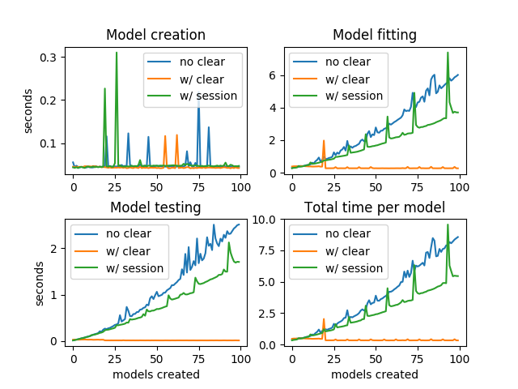

## 2018-01-18: When working with multiple models in Keras, don't forget to clear_session()



This image shows how running times change when creating, 
fitting and testing multiple models in a single session with Keras (Tensorflow backend).
Suppose you wish to create and train multiple models from scratch in a single script.
Not calling ```clear_session()``` before creating each new model will incur a cumulative
overhead in training and testing time.

An alternative to calling ```clear_session()``` would be to use 
```with tensorflow.Session().as_default()``` and run your model creation and testing code
in that context. However, this doesn't seem to offer better performance than ```clear_session()```.

The results and graphs were produced by running:
```python
from keras.backend.tensorflow_backend import clear_session
import tensorflow as tf

import numpy as np
import time


def create_model():
    model = Sequential()
    model.add(Dense(8, input_shape=(4,)))
    model.add(Dense(1))
    model.compile(loss='mse', optimizer='adam')
    return model


def stopwatch(func, *args, **kwargs):
    def run(*args, **kwargs):
        a = time.time()
        result = func(*args, **kwargs)
        duration = time.time() - a
        return result, duration

    return run


def test_stopwatch(iterations=10, clear=False, session=False):
    create = []
    fit = []
    test = []

    for _ in range(iterations):
        if session:
            with tf.Session().as_default():
                model, dt_create = stopwatch(create_model)()
                _, dt_fit = stopwatch(model.fit)(X, y, verbose=0, epochs=1)
                _, dt_test = stopwatch(model.test_on_batch)(X, y)

        else:
            model, dt_create = stopwatch(create_model)()
            _, dt_fit = stopwatch(model.fit)(X, y, verbose=0, epochs=1)
            _, dt_test = stopwatch(model.test_on_batch)(X, y)

        create.append(dt_create)
        fit.append(dt_fit)
        test.append(dt_test)

        if clear:
            clear_session()

    total_create = np.sum(create)
    total_fit = np.sum(fit)
    total_test = np.sum(test)
    print('='*80)
    print('create: {:.3f}, fit: {:.3f}, test: {:.3f} (total)'.format(total_create,
                                                         total_fit,
                                                         total_test).center(80, '='))
    print('='*80)

    return create, fit, test


X = np.array([[1, 1, 1, 1]])
y = np.array([[1]])
iterations = 100

print('without clear'.center(80, '='))
nc_create, nc_fit, nc_test = test_stopwatch(iterations=iterations)
clear_session()
print('with clear'.center(80, '='))
c_create, c_fit, c_test = test_stopwatch(iterations=iterations, clear=True)
print('with session'.center(80, '='))
s_create, s_fit, s_test = test_stopwatch(iterations=iterations, session=True)

nc_total = []
c_total = []
s_total = []

for i in range(len(nc_create)):
    nc_total.append(nc_create[i]+nc_fit[i]+nc_test[i])
    c_total.append(c_create[i]+c_fit[i]+c_test[i])
    s_total.append(s_create[i]+s_fit[i]+s_test[i])

try:
    import matplotlib.pyplot as plt
    plt.title('Using vs not using clear_session()')
    plt.subplot(221)
    plt.plot(nc_create, label='no clear')
    plt.plot(c_create, label='w/ clear')
    plt.plot(s_create, label='w/ session')
    ax = plt.gca()
    ax.set_title('Model creation')
    ax.legend()
    plt.ylabel('seconds')
    plt.subplot(222)
    plt.plot(nc_fit, label='no clear')
    plt.plot(c_fit, label='w/ clear')
    plt.plot(s_fit, label='w/ session')
    ax = plt.gca()
    ax.set_title('Model fitting')
    ax.legend()
    plt.subplot(223)
    plt.plot(nc_test, label='no clear')
    plt.plot(c_test, label='w/ clear')
    plt.plot(s_test, label='w/ session')
    ax = plt.gca()
    ax.set_title('Model testing')
    ax.legend()
    plt.xlabel('models created')
    plt.ylabel('seconds')
    plt.subplot(224)
    plt.plot(nc_total, label='no clear')
    plt.plot(c_total, label='w/ clear')
    plt.plot(s_total, label='w/ session')
    plt.xlabel('models created')
    ax = plt.gca()
    ax.set_title('Total time per model')
    ax.legend()

    plt.show()

except ImportError as e:
    pass
```